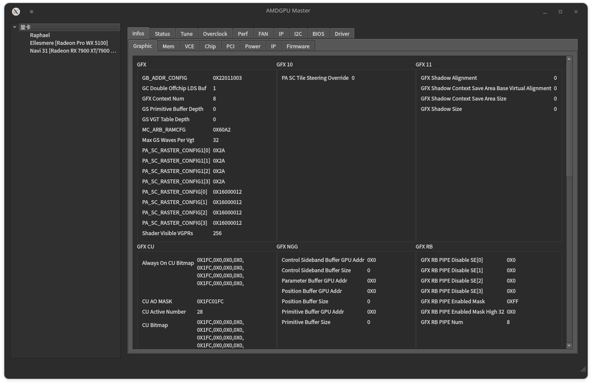
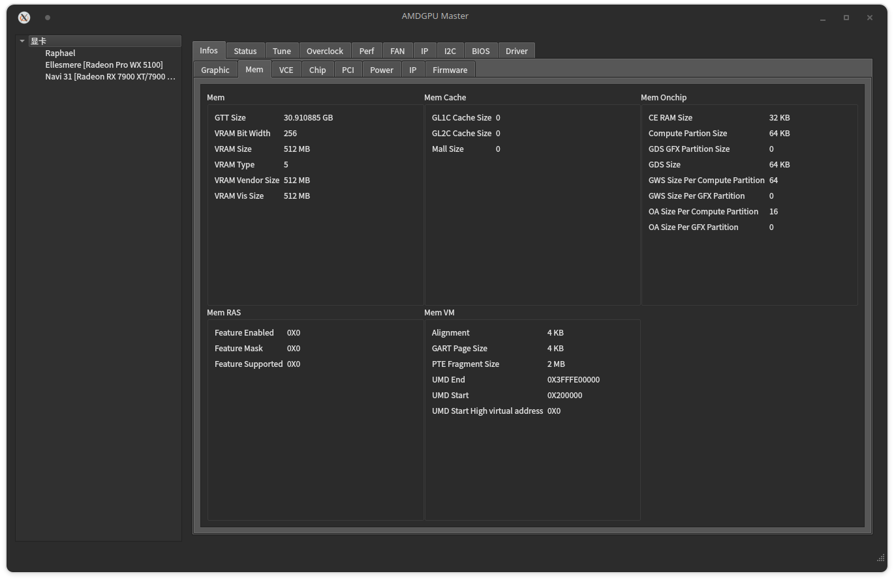
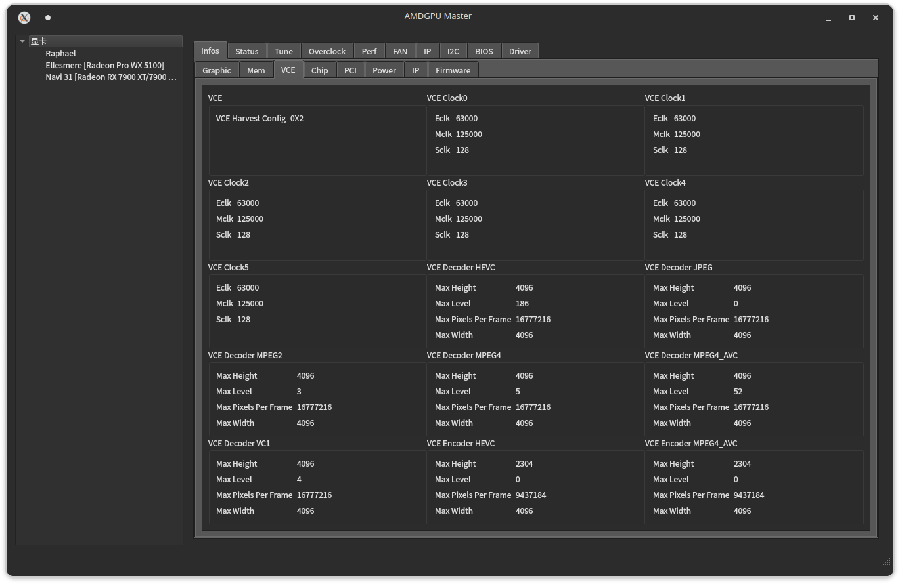
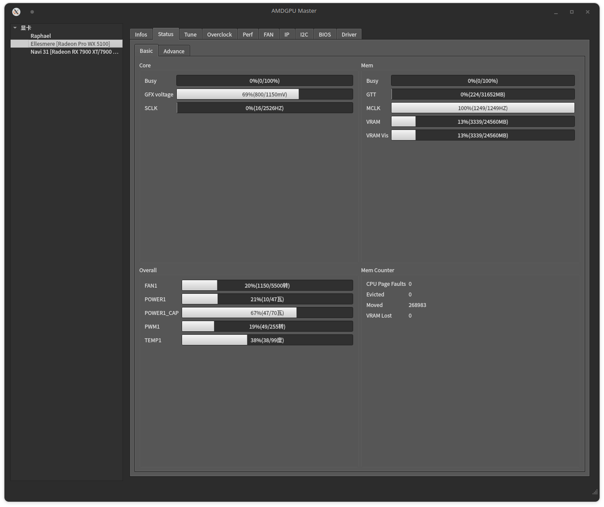
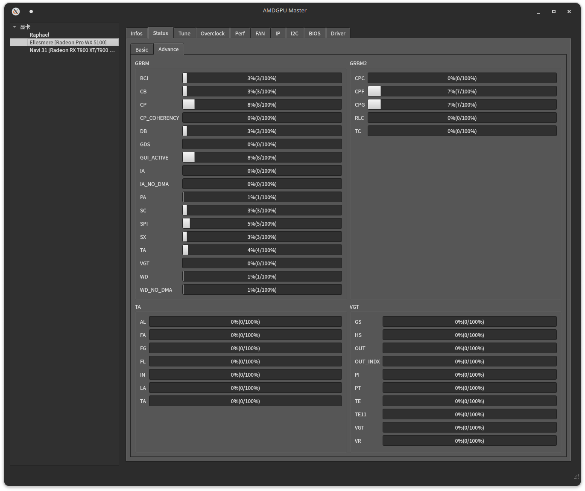

# AMDGPU Master
## Overview
1. Show detailed AMDGPU information like Voltage, Frequency, IP, Power, Firmware, VRAM, Core, PCI-E and other Chip informations.
2. Monitor GPU running status, including IP specific usage and all available status information reading from registers

## Screenshots 
infos:

status:

# Build
rootfs directory is libraries and headers this repo used, including libdrm precompiled binary. This repo is developed on latest Ubuntu with KDE. You can always use libdrm-dev package on latest Ubuntu instead of the precompile one.

To build, use QtCreator(with Qt6 installed) open AMDGPU-Master/amdgpu_master/CMakeLists.txt project file, click run.

# TODO
